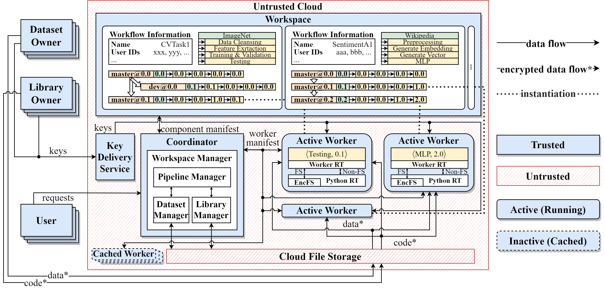

# SecCask

## Overview

Modern data analytics pipelines are highly dynamic, as they are constantly monitored and fine-tuned by both data engineers and scientists. Recent systems for managing pipelines make it easy to create, deploy, and track their evolution. However, they do not consider the privacy of both the data and the computation, which becomes a challenge for adoption as many of these systems are offered as services on the public cloud with less or no trust. Our goal is to design a secure and efficient data analytics pipeline management system, in which multiple parties could collaborate by providing datasets and libraries to form pipelines. 

To this end, we present SecCask, which leverages hardware-based trusted execution environments (TEEs) to ensure privacy. Our system overcomes the problems of a naive design that isolates complete pipeline execution in one enclave by administering enclaves and runtimes. Moreover, the objective of supporting fast-changing pipelines with components requiring low latency brings the challenge of reducing the cold start overhead - the main performance bottleneck in modern hardware. Our approach consists of reusing trusted runtimes for different pipeline components and caching them to avoid the cost of initialization. 

## Features

* Secure collaborative pipeline evolution with Intel SGX
* Runtime reusing and worker caching based on worker-component compatibility check
* Pipeline-aware Caching (PAC) strategy

## Installation

1. Install [Gramine LibOS](https://gramine.readthedocs.io/en/latest/) globally. For reproducibility, clone, build and install the LibOS from [this repo](https://github.com/seccask/gramine).
2. Clone, build and install [EncFSPython 3.9.13](https://github.com/seccask/encfspython-3.9.13) to `$PYTHONHOME`.
3. Copy project directory to `$APP_HOME`.
4. Build SecCask binary:
    ```bash
    # In $APP_HOME
    $ mkdir build && cd build
    $ conan install .. -pr=default -s build_type=Debug --build=missing
    $ cmake -DCMAKE_BUILD_TYPE=Debug -GNinja ..
    $ ninja
    ```
5. Use the requirements file to create a Python 3.9 virtual environment including necessary packages for the system as well as those for experiments:
    ```bash
    # In $APP_HOME
    $ python -m venv venv
    $ source venv/bin/activate
    (venv) $ python -m pip install -r requirements.txt
    ```
6. Build and install PyTorch from source using the following command. For more information, see [this Dockerfile](https://github.com/lsds/sgx-lkl/blob/oe_port/samples/ml/pytorch/Dockerfile).
    ```bash
    git clone https://github.com/pytorch/pytorch \
        && cd pytorch \
        && git checkout v1.4.1 \
        && git submodule update --init --recursive \
        && DEBUG=0 USE_CUDA=0 USE_MKLDNN=0 USE_OPENMP=0 ATEN_THREADING=NATIVE BUILD_BINARY=0 \
        CFLAGS="-D__EMSCRIPTEN__" \
        python setup.py install
    ```
7. Modify `$APP_HOME` and `$ENCFSPYTHON_HOME` in `gramine_manifest/Makefile`.
7. Build SecCask Gramine manifest in the virtual environment:
   
    ```bash
    (venv) $ cd $APP_HOME/gramine_manifest
    (venv) $ make && make SGX=1
    ```
    
    ---
    **NOTE**: The build process may fail with `ModuleNotFoundError: No module named 'graminelibos'`. If so, copy the corresponding package from the system-level package directory to that of `venv`:

    ```bash
    (venv) $ cp -r /usr/lib/python3/dist-packages/graminelibos /PATH/TO/VENV/lib/python3.9/site-packages
    ```
    
    ---
8. Comment line `SGX = "1"` in `gramine_manifest/seccask.manifest`:
   ```toml
   [loader.env]
   # SGX = "1"
   ```

## Start in Untrusted Mode

Run experiment `$EXP_NAME` with command:

```bash
# In $APP_HOME
(venv) $ gramine-direct ./gramine_manifest/seccask --coordinator --mode=tls --manifest=sklmnist
```

## Start in Trusted Mode

Run experiment `$EXP_NAME` with command:

```bash
# Without remote attestation
(venv) $ gramine-sgx ./gramine_manifest/seccask --coordinator --mode=tls --manifest=sklmnist
# With remote attestation
(venv) $ gramine-sgx ./gramine_manifest/seccask --coordinator --mode=ratls --manifest=sklmnist
```

## Other Useful Commands

See [CommonCommands.md](./CommonCommands.md).

Please remember to replace the absolute paths with your folder structure.

## Configuration

See commented configuration file `.conf/config.ini`.

## Experiments

SecCask supports running experiments specified by *experiment manifests*. Sample manifests are available under `exp/` directory. The `$EXP_NAME` in the experiment running commands are that of the manifest file name without `.yaml`. For example, to execute the experiment specified by `mlp2.yaml`, set `$EXP_NAME` to `mlp2`.

Please download the experimental workflow from [this link](https://drive.google.com/file/d/1owR_Pef4BPoitDgjZ46HttP75nh45R0O/view?usp=sharing) and extract all components to `$EXP_PREFIX`. The YAML files in the `exp/` directory are required to be modified as well:
```yaml
...
env:
  test_source_base: The absolute path of $EXP_PREFIX
  workspace_base: The temp path set in config.ini
...
```

### Available Experiments

#### Standard ML Tasks (For Unit Testing Purposes)

- mlp2
- mnist
- resnet18_c10
- sklmnist
- sklmnist_v1
- vgg16_c10
- vgg16_c10_v1

#### Case Studies

- cs_autolearn
- cs_sa

## Architecture


